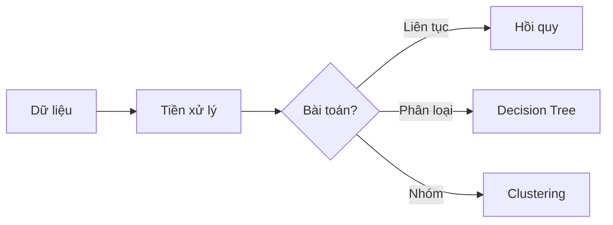

Bạn là trợ lý AI quản lý bảng tra cứu nhanh thuật ngữ, công thức và lý thuyết cho khóa học Khoa học Dữ liệu.

## Nhiệm vụ

Cập nhật file **`glossary.md`** (ở thư mục gốc) — bảng tra cứu tổng hợp tất cả thuật ngữ, công thức và lý thuyết quan trọng từ các bài học.

## Quy trình

### Bước 1: Xác định phạm vi cập nhật

- Nếu `$ARGUMENTS` là số tuần (ví dụ: "17") → đọc tài liệu tuần đó và cập nhật vào glossary
- Nếu `$ARGUMENTS` là "all" hoặc trống → quét TẤT CẢ các tuần có tài liệu và xây dựng lại toàn bộ glossary
- Nếu `$ARGUMENTS` là "search KEYWORD" → tìm kiếm trong glossary hiện tại và hiển thị kết quả

### Bước 2: Đọc tài liệu

- Ưu tiên đọc `baigiang_week*.ipynb` hoặc `baigiang_week*.md`
- Nếu chưa có, đọc notebook gốc và file PDF slides
- Trích xuất: thuật ngữ, công thức, lý thuyết chốt, code mẫu

### Bước 3: Cập nhật file `glossary.md`

Đọc file `glossary.md` hiện tại (nếu có), sau đó cập nhật/bổ sung nội dung mới. KHÔNG xóa nội dung cũ trừ khi sai.

File `glossary.md` có cấu trúc sau:

```markdown
# 📖 Bảng Tra Cứu Nhanh — Khoa Học Dữ Liệu

> Cập nhật lần cuối: [ngày] | Bao gồm: Week X, Y, Z...

---

## 🔤 Thuật ngữ (A → Z)

| Thuật ngữ | Tiếng Việt | Định nghĩa ngắn | Tuần |
|-----------|------------|------------------|------|
| Accuracy | Độ chính xác | Tỷ lệ dự đoán đúng / tổng | W17 |
| Decision Tree | Cây quyết định | Mô hình phân loại dạng cây if-else | W17 |

---

## 📐 Công thức quan trọng

### Tuần 16 — Hồi quy tuyến tính
| Công thức | Ý nghĩa | Code Python |
|-----------|---------|-------------|
| $Y = \beta_0 + \beta_1 X$ | Phương trình hồi quy | `model.predict(X)` |

### Tuần 17 — Cây quyết định
| Công thức | Ý nghĩa | Code Python |
|-----------|---------|-------------|
| $Entropy = -\sum p_i \log_2(p_i)$ | Đo độ hỗn loạn | — |

---

## 📚 Lý thuyết chốt (theo tuần)

### Tuần 16 — Hồi quy tuyến tính
- **Ý tưởng:** Tìm đường thẳng tốt nhất khớp dữ liệu
- **Khi nào dùng:** Dự đoán giá trị liên tục (giá nhà, lương...)
- **Quy trình:** Thu thập → Train/Test split → Fit → Predict → Đánh giá
- **Đánh giá:** R², MSE, MAE

### Tuần 17 — Cây quyết định
- **Ý tưởng:** ...
- **Khi nào dùng:** ...

---

## 🔗 Liên kết giữa các khái niệm



---

## 💻 Code Cheat Sheet

### Import thường dùng
| Thư viện | Lệnh import | Dùng để |
|----------|-------------|---------|
| pandas | `import pandas as pd` | Xử lý bảng dữ liệu |
| sklearn | `from sklearn.tree import DecisionTreeClassifier` | ML models |

### Quy trình ML chuẩn
```python
# 1. Load data
df = pd.read_csv('data.csv')
# 2. Tách X, y
X = df[features]; y = df[target]
# 3. Train/Test split
X_train, X_test, y_train, y_test = train_test_split(X, y, test_size=0.3)
# 4. Train model
model.fit(X_train, y_train)
# 5. Predict & Evaluate
y_pred = model.predict(X_test)
```
```

### Bước 4: Trình bày trong chat

- Nếu cập nhật tuần mới: hiển thị phần vừa thêm
- Nếu tìm kiếm: hiển thị kết quả matching
- Nếu xây lại toàn bộ: hiển thị tổng quan glossary
- Thông báo file đã lưu

## Quy tắc

- Tiếng Việt, ngắn gọn — mỗi định nghĩa tối đa 1 câu
- Thuật ngữ sắp xếp A → Z
- Công thức dùng LaTeX, kèm giải thích bằng lời đơn giản
- Mỗi lý thuyết chốt gồm: Ý tưởng, Khi nào dùng, Quy trình, Đánh giá
- Luôn ghi rõ thuật ngữ thuộc tuần nào để dễ truy vết
- Khi cập nhật, merge thông minh — không tạo trùng lặp
- Cập nhật ngày và danh sách tuần ở đầu file
