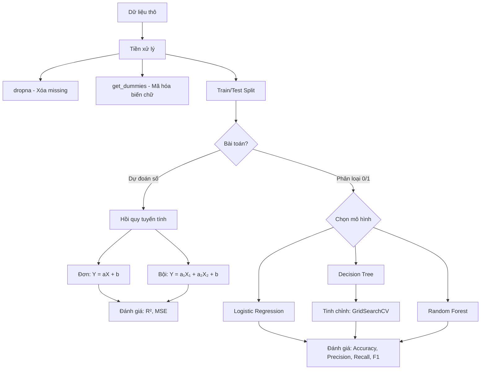

# 📖 Bảng Tra Cứu Nhanh — Khoa Học Dữ Liệu

> Cập nhật lần cuối: 2026-04-06 | Bao gồm: Week 16, 17

---

## 🔤 Thuật ngữ (A → Z)

| Thuật ngữ | Tiếng Việt | Định nghĩa ngắn | Tuần |
|-----------|------------|------------------|------|
| Accuracy | Độ chính xác | Tỷ lệ dự đoán đúng trên tổng số dự đoán | W16 |
| Bootstrap Sampling | Lấy mẫu có hoàn lại | Mỗi cây trong Random Forest học từ một mẫu ngẫu nhiên (lấy có hoàn lại) | W17 |
| Categorical Variable | Biến phân loại | Biến có giá trị dạng chữ/nhóm (High, Low...), cần mã hóa thành số | W16 |
| Classification | Phân lớp / Phân loại | Bài toán dự đoán nhãn/lớp rời rạc ("Loại nào?"), khác Regression ("Bao nhiêu?") | W17 |
| Coefficient (a) | Hệ số góc | Cho biết X tăng 1 đơn vị thì Y thay đổi bao nhiêu | W16 |
| Cross-Validation (CV) | Kiểm chứng chéo | Chia dữ liệu thành k phần, luân phiên train/test để đánh giá ổn định hơn | W17 |
| Decision Tree | Cây quyết định | Mô hình phân loại dạng sơ đồ câu hỏi Yes/No, gồm nút gốc → nút trung gian → nút lá | W17 |
| F1-Score | Điểm F1 | Trung bình hài hòa của Precision và Recall | W16 |
| Feature Importance | Độ quan trọng đặc trưng | Điểm số cho biết mỗi biến đóng góp bao nhiêu vào dự đoán của mô hình | W17 |
| Feature Subsampling | Lấy mẫu đặc trưng | Mỗi cây trong Random Forest chỉ xét một tập con ngẫu nhiên các features | W17 |
| Gini Index | Chỉ số Gini | Đo độ "lẫn lộn" của nhóm: 0 = tinh khiết (tốt nhất), 0.5 = lẫn lộn tối đa (tệ nhất) | W17 |
| GridSearchCV | Tìm kiếm lưới | Tự động thử tất cả tổ hợp siêu tham số và chọn bộ tốt nhất | W17 |
| Hyperparameter | Siêu tham số | Tham số do người dùng thiết lập trước khi huấn luyện (max_depth, min_samples...) | W17 |
| Intercept (b) | Hệ số chặn | Giá trị Y khi X = 0 | W16 |
| Internal Node | Nút trung gian | Nút trong cây quyết định chứa câu hỏi phân chia dữ liệu | W17 |
| LabelEncoder | Bộ mã hóa nhãn | Chuyển nhãn chữ ("Tốt"/"Xấu") thành số (1/0) | W16 |
| Leaf Node | Nút lá | Nút cuối cùng trong cây, chứa kết quả dự đoán (nhãn lớp) | W17 |
| Least Squares | Bình phương tối thiểu | Phương pháp tìm a, b sao cho tổng sai số bình phương nhỏ nhất | W16 |
| Linear Regression | Hồi quy tuyến tính | Dự đoán giá trị liên tục bằng đường thẳng Y = aX + b | W16 |
| Logistic Regression | Hồi quy logistic | Dự đoán phân loại (0/1) bằng hàm Sigmoid | W16 |
| Machine Learning | Học máy | Nhánh của AI giúp máy tính tự học từ dữ liệu mà không cần lập trình cụ thể | W17 |
| MSE (Mean Squared Error) | Sai số bình phương trung bình | Trung bình bình phương sai số giữa dự đoán và thực tế, càng nhỏ càng tốt | W16 |
| Multiple Linear Regression | Hồi quy tuyến tính bội | Dự đoán Y từ nhiều biến X: Y = a₁X₁ + a₂X₂ + ... + b | W16 |
| One-Hot Encoding | Mã hóa one-hot | Chuyển biến phân loại thành các cột 0/1 bằng `pd.get_dummies()` | W16 |
| Overfitting | Quá khớp | Mô hình "học thuộc" dữ liệu huấn luyện nhưng dự đoán kém trên dữ liệu mới | W17 |
| Precision | Độ chính xác dương | Trong những cái mô hình nói "Tốt" → thực sự tốt bao nhiêu %? | W16 |
| R² (R-squared) | Hệ số xác định | Mô hình giải thích được bao nhiêu % biến thiên dữ liệu (0→1, gần 1 = tốt) | W16 |
| Random Forest | Rừng ngẫu nhiên | Tập hợp nhiều cây quyết định, lấy đa số phiếu bầu → chính xác & ổn định hơn | W17 |
| Recall | Độ nhạy | Trong tất cả cái thực sự "Tốt" → mô hình tìm ra được bao nhiêu %? | W16 |
| Regression | Hồi quy | Kỹ thuật ML dự đoán giá trị dựa trên dữ liệu đã biết | W16 |
| Root Node | Nút gốc | Nút đầu tiên của cây quyết định, chứa câu hỏi quan trọng nhất | W17 |
| Sigmoid Function | Hàm Sigmoid | Hàm "ép" giá trị vào khoảng 0-1, dùng trong Logistic Regression | W16 |
| Simple Linear Regression | Hồi quy tuyến tính đơn | Dự đoán Y từ 1 biến X duy nhất | W16 |
| Supervised Learning | Học có giám sát | Học từ dữ liệu đã có nhãn/đáp án, gồm Regression và Classification | W17 |
| Test Set | Tập kiểm tra | 10-20% dữ liệu dùng để kiểm tra mô hình (đề thi mới) | W16 |
| Train/Test Split | Chia tập huấn luyện/kiểm tra | Chia dữ liệu thành 2 phần: học và kiểm tra | W16 |
| Training Set | Tập huấn luyện | 80-90% dữ liệu dùng để "dạy" mô hình | W16 |

---

## 📐 Công thức quan trọng

### Tuần 16 — Hồi quy (Regression)

| Công thức | Ý nghĩa | Code Python |
|-----------|---------|-------------|
| $Y = aX + b$ | Hồi quy đơn: dự đoán Y từ 1 biến X | `model.predict(X)` |
| $Y = a_1X_1 + a_2X_2 + ... + a_nX_n + b$ | Hồi quy bội: dự đoán Y từ nhiều biến | `model.predict(X)` |
| $\sigma(z) = \frac{1}{1 + e^{-z}}$ | Hàm Sigmoid: ép giá trị về 0-1 | Tự động trong `LogisticRegression` |
| $R^2 = 1 - \frac{SS_{res}}{SS_{tot}}$ | Tỷ lệ biến thiên được mô hình giải thích (gần 1 = tốt) | `model.score(X, y)` |
| $MSE = \frac{1}{n}\sum(y_i - \hat{y}_i)^2$ | Trung bình bình phương sai số (nhỏ = tốt) | `mean_squared_error(y, y_pred)` |
| $F1 = 2 \times \frac{Precision \times Recall}{Precision + Recall}$ | Trung bình hài hòa Precision & Recall | `f1_score(y, y_pred)` |

### Tuần 17 — Cây Quyết Định (Decision Tree)

| Công thức | Ý nghĩa | Code Python |
|-----------|---------|-------------|
| $Gini = 1 - \sum_{i=1}^{n} p_i^2$ | Đo độ "lẫn lộn" của nhóm (0 = tinh khiết, 0.5 = lẫn lộn tối đa) | Tự động trong `DecisionTreeClassifier` |
| $Accuracy = \frac{TP + TN}{Total}$ | Tỷ lệ dự đoán đúng trên tổng | `accuracy_score(y_true, y_pred)` |
| $Precision = \frac{TP}{TP + FP}$ | Trong số dự đoán Positive, bao nhiêu đúng? | `precision_score(y_true, y_pred)` |
| $Recall = \frac{TP}{TP + FN}$ | Trong số thực sự Positive, tìm ra bao nhiêu? | `recall_score(y_true, y_pred)` |

---

## 📚 Lý thuyết chốt (theo tuần)

### Tuần 16 — Hồi quy (Regression)

- **Ý tưởng:** Dự đoán giá trị (số hoặc phân loại) dựa trên dữ liệu đã biết — "nhìn quá khứ đoán tương lai"
- **Khi nào dùng:**
  - Hồi quy tuyến tính → dự đoán **giá trị liên tục** (giá nhà, doanh số, điểm thi)
  - Hồi quy logistic → dự đoán **phân loại** (Tốt/Xấu, Có/Không, 0/1)
- **Quy trình:** Dữ liệu thô → Tiền xử lý (dropna, get_dummies) → Train/Test Split → Fit → Predict → Đánh giá
- **Đánh giá:**
  - Hồi quy: R² (gần 1 = tốt), MSE (nhỏ = tốt)
  - Phân loại: Accuracy, Precision, Recall, F1-Score
- **Lưu ý:** Biến phân loại (chữ) phải mã hóa thành số trước khi đưa vào mô hình (One-Hot Encoding hoặc LabelEncoder)

### Tuần 17 — Cây Quyết Định (Decision Tree)

- **Ý tưởng:** Sơ đồ câu hỏi Yes/No tự động — mỗi câu hỏi chia dữ liệu thành nhóm "tinh khiết" hơn, dẫn đến dự đoán cuối cùng
- **Khi nào dùng:** Bài toán phân loại (Classification) — dự đoán nhãn rời rạc (Hài lòng/Không, Spam/Không spam)
- **Quy trình:** Dữ liệu → dropna + get_dummies → Train/Test Split → Fit → Predict → Đánh giá → Tinh chỉnh siêu tham số (GridSearchCV)
- **Đánh giá:** Accuracy, Precision, Recall, F1-Score
- **Chống Overfitting:** Dùng 3 siêu tham số: `max_depth` (giới hạn độ sâu), `min_samples_split` (số mẫu tối thiểu để tách), `min_samples_leaf` (số mẫu tối thiểu ở lá)
- **Random Forest:** Kết hợp nhiều cây (Bootstrap Sampling + Feature Subsampling), lấy đa số phiếu → chính xác & ổn định hơn cây đơn lẻ
- **Kết quả thực tế:** Decision Tree đạt Accuracy 0.89 → sau GridSearchCV: 0.90 → Random Forest: 0.92

---

## 🔗 Liên kết giữa các khái niệm



---

## 💻 Code Cheat Sheet

### Import thường dùng

| Thư viện | Lệnh import | Dùng để |
|----------|-------------|---------|
| numpy | `import numpy as np` | Tính toán mảng số |
| pandas | `import pandas as pd` | Xử lý bảng dữ liệu |
| matplotlib | `import matplotlib.pyplot as plt` | Vẽ biểu đồ |
| sklearn - Linear | `from sklearn.linear_model import LinearRegression` | Hồi quy tuyến tính |
| sklearn - Logistic | `from sklearn.linear_model import LogisticRegression` | Hồi quy logistic |
| sklearn - Split | `from sklearn.model_selection import train_test_split` | Chia train/test |
| sklearn - Metrics | `from sklearn.metrics import accuracy_score, precision_score, recall_score, f1_score` | Đánh giá phân loại |
| sklearn - Encoder | `from sklearn.preprocessing import LabelEncoder` | Mã hóa nhãn chữ → số |
| sklearn - Tree | `from sklearn.tree import DecisionTreeClassifier` | Cây quyết định |
| sklearn - Forest | `from sklearn.ensemble import RandomForestClassifier` | Rừng ngẫu nhiên |
| sklearn - GridSearch | `from sklearn.model_selection import GridSearchCV` | Tìm siêu tham số tối ưu |
| sklearn - plot_tree | `from sklearn.tree import plot_tree` | Vẽ hình cây quyết định |

### Quy trình ML chuẩn (Tuần 16)

```python
# 1. Load & tiền xử lý
df = pd.read_csv('data.csv')
df.dropna(inplace=True)

# 2. Mã hóa biến phân loại (nếu có)
df_encoded = pd.get_dummies(df['cot_chu'])

# 3. Tách X (đầu vào) và y (đầu ra)
X = df[['feature1', 'feature2']]
y = df['target']

# 4. Chia train/test
X_train, X_test, y_train, y_test = train_test_split(X, y, test_size=0.2, random_state=42)

# 5. Huấn luyện
model = LinearRegression()       # hoặc LogisticRegression()
model.fit(X_train, y_train)

# 6. Dự đoán
y_pred = model.predict(X_test)

# 7. Đánh giá
r2 = model.score(X_test, y_test)          # Hồi quy: R²
accuracy = accuracy_score(y_test, y_pred)  # Phân loại: Accuracy
```

### Decision Tree + GridSearchCV (Tuần 17)

```python
# 1. Cây quyết định cơ bản
tree = DecisionTreeClassifier(random_state=42)
tree.fit(X_train, Y_train)
y_pred = tree.predict(X_test)

# 2. Tinh chỉnh siêu tham số bằng GridSearchCV
params = {
    'max_depth': [3, 5, 7, 10, None],
    'min_samples_split': [2, 5, 10, 20],
    'min_samples_leaf': [2, 5, 10, 20]
}
grid = GridSearchCV(DecisionTreeClassifier(random_state=42),
                    param_grid=params, scoring='accuracy', cv=5)
grid.fit(X_train, Y_train)
best_tree = grid.best_estimator_

# 3. Random Forest (nhiều cây → chính xác hơn)
forest = RandomForestClassifier(random_state=42)
forest.fit(X_train, Y_train)

# 4. Xem feature importance
importance = pd.Series(best_tree.feature_importances_, index=X.columns)
importance.sort_values(ascending=False).head(10).plot(kind='bar')

# 5. Vẽ cây quyết định
plot_tree(tree, filled=True, feature_names=X.columns,
          class_names=['Hài Lòng', 'Không Hài Lòng'], max_depth=3)
```
