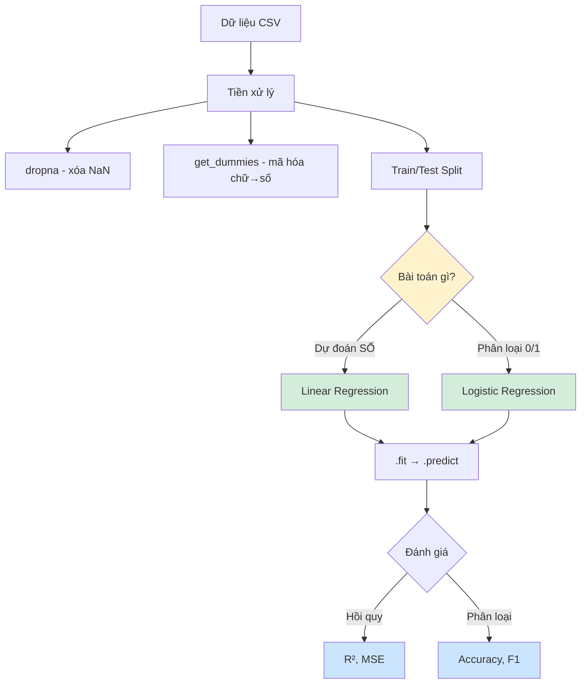

# Tóm tắt Tuần 16: Hồi Quy (Regression)

## Bảng tổng hợp

| Tuần | Chủ đề | Ý chính | Code quan trọng |
|------|--------|---------|-----------------|
| 16 | Hồi quy | Y = aX + b, R², MSE, Logistic, One-Hot Encoding | `LinearRegression().fit()`, `LogisticRegression()` |

---

## Công thức & Khái niệm chốt

- **Hồi quy đơn:** `Y = a×X + b` → dự đoán 1 số từ 1 biến (VD: giờ học → điểm)
- **Hồi quy bội:** `Y = a₁X₁ + a₂X₂ + ... + b` → nhiều biến đầu vào
- **Hồi quy logistic:** phân loại 0/1, dùng hàm Sigmoid ép về xác suất 0-1
- **R²** → mô hình giải thích bao nhiêu % dữ liệu (gần 1 = tốt)
- **MSE** → trung bình bình phương sai số (càng nhỏ càng tốt)
- **One-Hot Encoding** → chuyển biến chữ ("High", "Low") thành cột 0/1
- **Train/Test Split** → 80-90% học, 10-20% kiểm tra
- **Gradient Descent** → tìm a, b tốt nhất bằng cách "đi xuống đồi" giảm sai số
- **Learning Rate** → bước chân to/nhỏ khi đi xuống đồi
- **Accuracy/Precision/Recall/F1** → đánh giá mô hình phân loại

---

## Code Cheat Sheet

```python
# Hồi quy tuyến tính
from sklearn.linear_model import LinearRegression
model = LinearRegression()
model.fit(X_train.reshape(-1,1), Y_train)
Y_pred = model.predict(X_test.reshape(-1,1))
a, b = model.coef_[0], model.intercept_

# Chia dữ liệu
from sklearn.model_selection import train_test_split
X_train, X_test, Y_train, Y_test = train_test_split(X, Y, test_size=0.2, random_state=42)

# Đánh giá hồi quy
from sklearn.metrics import r2_score, mean_squared_error
r2 = r2_score(Y_test, Y_pred)
mse = mean_squared_error(Y_test, Y_pred)

# One-Hot Encoding
encoded = pd.get_dummies(df['col_chu'])
X = pd.concat([encoded, df[['col_so1', 'col_so2']]], axis=1)

# Hồi quy Logistic
from sklearn.linear_model import LogisticRegression
model = LogisticRegression()
model.fit(X_train, Y_train)

# Đánh giá phân loại
from sklearn.metrics import accuracy_score, f1_score
acc = accuracy_score(Y_test, Y_pred)
f1 = f1_score(Y_test, Y_pred)
```

---

## Sơ đồ kiến thức



---

## Checklist tự đánh giá

- [ ] Tôi hiểu **hồi quy tuyến tính** là vẽ đường thẳng qua dữ liệu
- [ ] Tôi phân biệt được **hồi quy đơn** (1 biến) vs **hồi quy bội** (nhiều biến)
- [ ] Tôi hiểu **hồi quy logistic** dùng để phân loại, không phải dự đoán số
- [ ] Tôi biết **Gradient Descent** = đi xuống đồi để tìm sai số nhỏ nhất
- [ ] Tôi biết dùng **`pd.get_dummies()`** để chuyển biến chữ thành số
- [ ] Tôi biết **tại sao** phải chia Train/Test (tránh học vẹt)
- [ ] Tôi có thể viết code **huấn luyện + đánh giá** mô hình hồi quy
