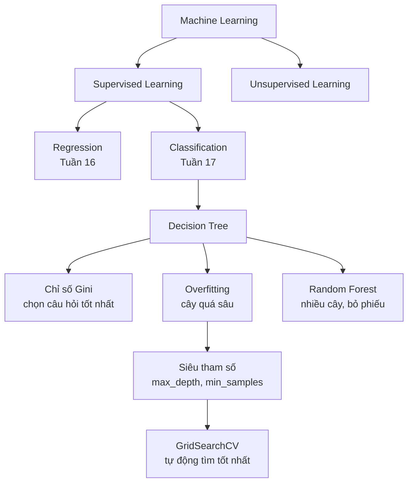

# Tóm tắt Tuần 17 — Cây Quyết Định (Decision Tree)

---

## 1. Bảng tổng hợp

| Tuần | Chủ đề | Ý chính | Code quan trọng |
|------|--------|---------|-----------------|
| 17 | Decision Tree / Classification | Gini, overfitting, Random Forest | `DecisionTreeClassifier().fit()` |

---

## 2. Công thức & Khái niệm chốt

**Supervised Learning — 2 bài toán:**
- **Regression** → đầu ra là số liên tục ("Bao nhiêu?")
- **Classification** → đầu ra là nhãn/lớp ("Loại nào?") ← tuần này

**Chỉ số Gini:**
- `Gini = 1 - (p₁² + p₂²)` — đo độ "lẫn lộn" của một nhóm
- Gini = 0 → hoàn toàn tinh khiết (tốt nhất) | Gini = 0.5 → lẫn lộn tối đa (tệ nhất)
- Cây chọn câu hỏi nào giúp Gini giảm nhiều nhất

**3 thành phần của cây:**
- **Root Node** → câu hỏi đầu tiên, quan trọng nhất
- **Internal Node** → các câu hỏi trung gian
- **Leaf Node** → kết quả/nhãn cuối cùng

**Overfitting:**
- Cây quá sâu → học thuộc train set → kém trên test set
- Dấu hiệu: Train accuracy >> Test accuracy

**3 siêu tham số chống overfitting:**
- `max_depth` — độ sâu tối đa của cây
- `min_samples_split` — số mẫu tối thiểu để chia nút
- `min_samples_leaf` — số mẫu tối thiểu ở nút lá

**4 thước đo đánh giá:**
- `Accuracy` — đúng tổng thể
- `Precision` — khi nói "KHL", đúng bao nhiêu %
- `Recall` — tìm ra bao nhiêu % người KHL thực sự
- `F1 Score` — trung bình hài hòa Precision & Recall

**Random Forest:**
- Kết hợp nhiều cây → bỏ phiếu đa số
- 2 yếu tố ngẫu nhiên: Bootstrap Sampling + Feature Randomness
- Chính xác & ổn định hơn cây đơn lẻ

---

## 3. Code cheat sheet

```python
from sklearn.tree import DecisionTreeClassifier
from sklearn.ensemble import RandomForestClassifier
from sklearn.model_selection import train_test_split, GridSearchCV
from sklearn.metrics import accuracy_score, f1_score, recall_score, precision_score

# Tiền xử lý
df_clean = df.dropna()
df_encoded = pd.get_dummies(df_clean, drop_first=True, dtype=int)

# Chia train/test
X_train, X_test, Y_train, Y_test = train_test_split(X, Y, test_size=0.2, random_state=42)

# Decision Tree
tree = DecisionTreeClassifier(max_depth=7, random_state=42)
tree.fit(X_train, Y_train)
y_pred = tree.predict(X_test)
print(accuracy_score(Y_test, y_pred))

# GridSearchCV — tìm tham số tốt nhất
params = {'max_depth': [3,5,7,10], 'min_samples_split': [2,10,20]}
grid = GridSearchCV(DecisionTreeClassifier(), params, cv=5, refit='accuracy')
grid.fit(X_train, Y_train)
best_model = grid.best_estimator_

# Random Forest
forest = RandomForestClassifier(n_estimators=100, random_state=42)
forest.fit(X_train, Y_train)

# Feature Importance
pd.Series(tree.feature_importances_, index=X.columns).sort_values(ascending=False)
```

---

## 4. Sơ đồ kiến thức



---

## 5. Checklist tự đánh giá

- [ ] Tôi phân biệt được Regression vs Classification
- [ ] Tôi hiểu Gini đo cái gì và giá trị nào là tốt
- [ ] Tôi biết 3 thành phần của cây (Root, Internal, Leaf)
- [ ] Tôi hiểu overfitting là gì và cách nhận ra nó
- [ ] Tôi biết dùng `max_depth`, `min_samples_split`, `min_samples_leaf`
- [ ] Tôi có thể viết code train + predict + đánh giá một Decision Tree
- [ ] Tôi biết dùng `GridSearchCV` để tìm tham số tốt nhất
- [ ] Tôi hiểu Random Forest khác Decision Tree ở điểm gì
- [ ] Tôi biết đọc Feature Importance và giải thích ý nghĩa
